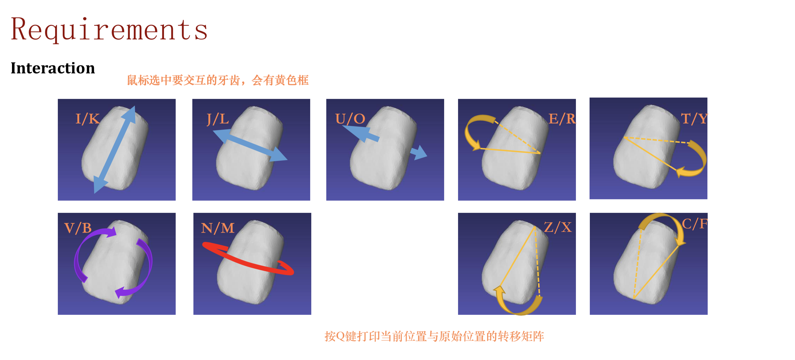
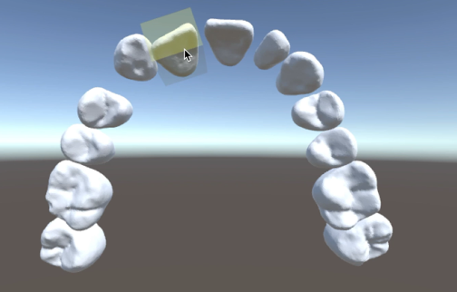
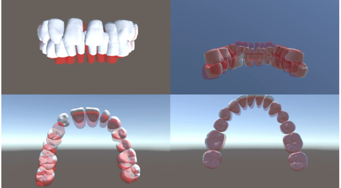
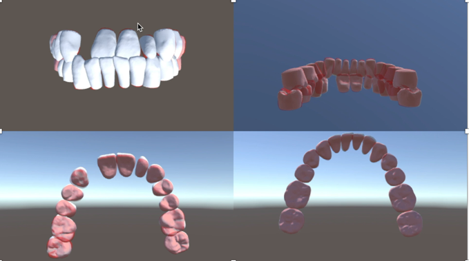

## 运行
* 运行环境：Unity 2018.3.9f1
* 工程文件目录 ```./code/project```
* 交互场景 ```./code/project/Asset/Scenes/interaction```
* 插值还原场景
	* 样例数据：```./code/project/Asset/Scenes/Adjust```
	* TianluZhong:```./code/project/Asset/TianluZhong/TianluZhong```
	* TianqiFeng:```./code/project/Asset/TianqiFeng/TianqiFeng```
	* TinglaiChen:```./code/project/Asset/TinglaiChen```

## 代码说明
* 插值缺失牙齿位置的代码 ```./code/regression.py```
* 导入模型文件并计算包围盒的代码 ```./code/project/Asset/Script/ImportSTL.cs```
* 交互部分的代码```./code/project/Asset/Script/Intersaction.cs```
* 计算转移矩阵的代码
	* 计算final相对initial的转移矩阵：```./code/project/Asset/TransformMatrix.cs```
	* 计算交互后当前位置与initial的转移矩阵```./code/project/Asset/Interdaction.cs```

## 实现功能
1.	导入STL模型文件
2.	实现Phong Shading 
3.	计算牙齿OBB包围盒
4. 计算牙齿的三个向量
5.	实现牙齿的键盘鼠标交互
	* 操作细节说明：
	
6.	计算牙齿当前位置与原始位置的转移矩阵转移矩阵。
7.	处理缺失牙齿: 使用线性回归模型来预测缺失牙齿的位置。
8. 对final位置与initial位置之间的位置插值出牙齿调整的过程。
9.	插值动画: 通过Unity实现插值动画。
10.	对三个病例和样例数据进行了插值还原。

## 效果展示







